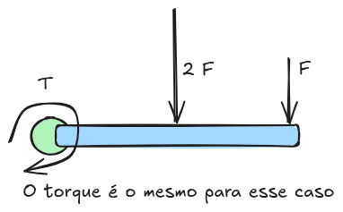

# Notas

### Plano de execução

- Ler artigos e entender as técnicas utilizadas.
- Montar simulação com os mesmo sensores utilizados
- Implementar sistema para detecção do ponto de colisão
- Implementar uma aplicação para esse sistema no ambiente simulado
- Hardware para implementação real? É possível? Qual o melhor que pode ser feito com o iiwa?

### Notas sobre artigos:

Lendo o artigo sobre o intrinsic sense of touch o método 'momentum-based monitoring' é mencionado.
Fui ler o artigo sobre esse assunto chamado 'Collision Detection, Identication, and Localization 
on the DLR SARA Robot with Sensing Redundancy'. Na introdução são mencionadas outras técnicas para 
detecção do ponto de colisão com o robô.

São necessários empregar sensores de força e torque adicionais. Aquele caso que eu pensei realmente
acontece. Perto da base não é possível saber se uma grande força próxima do eixo foi aplicada ou se
foi uma pequena força numa distância maior. Esses sensores adicionais são principalmente colocados
no efetuador final mas também podem ser empregados na base ou então na cadeia cinemática. 

Para que os sensores de força e torque adicionais funcionem corretamente, é preciso considerar 
corretamente os efeitos dinâmicos como inercia, gravidade e os efeitos da movimentação do robô. 
Isso é bastante desafiador porque é preciso ter uma estimativa precisa da aceleração já que não é 
possível medir ela.

Entendendo os fundamentos dos cálculos:

### Dúvidas

Qual o número necessário de sensores e quais são eles? O que os autores querem dizer com redundância?

### TODO:

Verificar outros métodos de detecção de colisão:

[2] S. Morinaga and K. Kosuge, “Collision detection system for manipulator based on adaptive 
impedance control law”
[3] K. Ohnishi, M. Shibata, and T. Murakami, “Motion Control for Advanced Mechatronics,”
[4] S. Haddadin, Towards Safe Robots: Approaching Asimov’s 1st Law
[5] C. Lee, J. Lee, J. Malzahn, N. Tsagarakis, and S. Oh, “A twostaged residual for resilient 
external torque estimation with series elastic actuators”
[6] G. Garofalo, N. Mansfeld, J. Jankowski, and C. Ott, “Sliding mode momentum observers for 
estimation of external torques and joint acceleration”
[7] A. De Luca, A. Albu-Schaffer, S. Haddadin, and G. Hirzinger, “Collision Detection and Safe 
Reaction with the DLR-III Lightweight Manipulator Arm,”